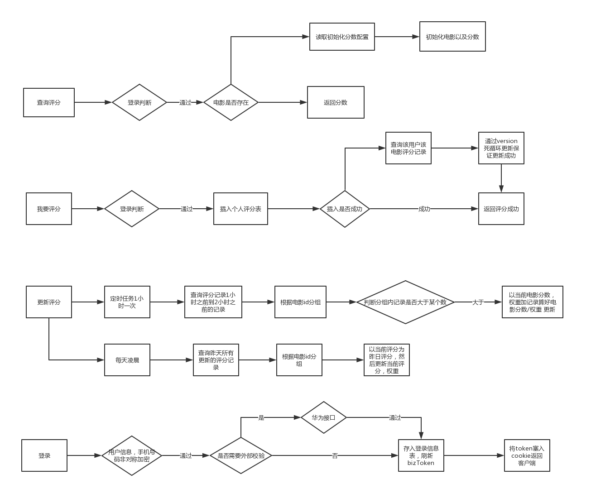

#评分系统技术方案


##系统流程图


##表结构设计
```java
DROP TABLE IF EXISTS `user_base_info`;
CREATE TABLE `user_base_info` (
  `id` bigint NOT NULL AUTO_INCREMENT,
  `gmt_create`   datetime DEFAULT NULL,
  `gmt_modified` datetime DEFAULT NULL,
  `status` int  NOT NULL COMMENT '删除状态 1-正常 0-删除',
  `mobile`   bigint not null comment '手机号码',
  `name` varchar(256) DEFAULT null comment '用户名称',
  `third_uid` varchar(256) DEFAULT null comment '外部uid(暂时也是手机号)',
  `user_portrait` varchar(256) DEFAULT null comment '用户头像',
  `extend` text DEFAULT null comment '扩展字段',
  PRIMARY KEY (`id`),
  UNIQUE key `uk_m_u`(`mobile`,`third_uid`)
) ENGINE=InnoDB AUTO_INCREMENT=1 DEFAULT CHARSET=utf8 COMMENT='用户基础信息表';

DROP TABLE IF EXISTS `user_login_info`;
CREATE TABLE `user_login_info` (
  `id` bigint NOT NULL AUTO_INCREMENT,
  `gmt_create`   datetime DEFAULT NULL,
  `gmt_modified` datetime DEFAULT NULL,
  `status` int  NOT NULL COMMENT '删除状态 1-正常 0-删除',
  `uid`   bigint not null comment 'user_info表的主键id',
  `device_id` varchar(256) not null comment '设备id',
  `biz_token` varchar(256) not null comment '业务token',
  `last_login_time` datetime DEFAULT NULL comment '最后登录时间',
  PRIMARY KEY (`id`),
  UNIQUE key `uk_u_d`(`uid`,`device_id`)
) ENGINE=InnoDB AUTO_INCREMENT=1 DEFAULT CHARSET=utf8 COMMENT='用户登录表';


DROP TABLE IF EXISTS `movie`;
CREATE TABLE `movie` (
  `id` bigint NOT NULL AUTO_INCREMENT,
  `gmt_create`   datetime DEFAULT NULL,
  `gmt_modified` datetime DEFAULT NULL,
  `status` int  NOT NULL COMMENT '删除状态 1-正常 0-删除',
  `movie_id` varchar(128) not null comment '外部电影id',
  `movie_name` varchar(128) not null comment '电影名称',
  `init_score` int(4) not null comment '初始分数',
  `init_weight` bigint not null comment '初始权重(人数)',
  `score` int(4) not null comment '当前电影分数',
  `weight` int(4) not null comment '当前权重',
  `yesterday_score` int(4) not null comment '昨日分数',
  `extend` text DEFAULT null comment '电影扩展信息',
  `version` bigint not null comment '版本',
  PRIMARY KEY (`id`),
  UNIQUE key `uk_m_id`(`movie_id`)
) ENGINE=InnoDB AUTO_INCREMENT=1 DEFAULT CHARSET=utf8 COMMENT='电影基础信息表';


DROP TABLE IF EXISTS `score`;
CREATE TABLE `score` (
  `id` bigint NOT NULL AUTO_INCREMENT,
  `gmt_create`   datetime DEFAULT NULL,
  `gmt_modified` datetime DEFAULT NULL,
  `status` int  NOT NULL COMMENT '删除状态 1-正常 0-删除',
  `movie_id` varchar(128) not null comment '电影id',
  `score` int(4) not null comment '评分',
  `uid`   bigint not null comment '用户id',
  `extend` text DEFAULT null comment '扩展字段',
  `version` bigint not null DEFAULT 0 comment '版本',
  PRIMARY KEY (`id`),
  UNIQUE key `uk_s_id`(`movie_id`,`uid`)
) ENGINE=InnoDB AUTO_INCREMENT=1 DEFAULT CHARSET=utf8 COMMENT='电影评分表';
```